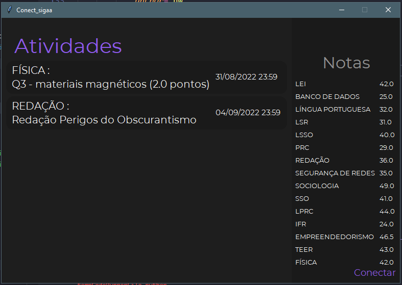

# Connect_sigaa
# Connect_sigaa Projeto simples pra tentar automatizar e facilitar o acesso dos alunos as notas postadas pelos professores no Sistema Integrado de Gestão de Atividades Acadêmicas ( SIGAA )

Ultima alteração:
- Mudanças visuais
- Implementação completa da função de exibição de atividades
- Organização da exibição de notas

Próximo passo:
- Configuração da barra de rolagem para o scroll do mouse
 

